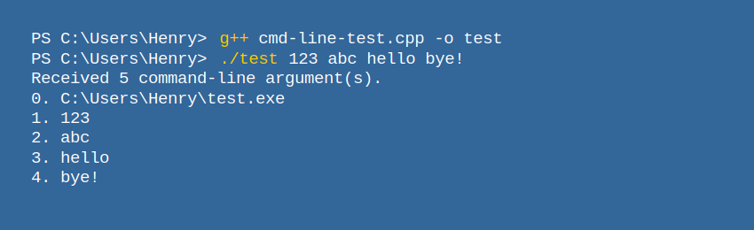

# 命令行与 Shell

## 编程使计算机得以工作

要使用计算机，也就是使用计算机做有意义的事情，就需要编程。

计算机程序的本质就是一串 CPU 能够理解的二进制数码。最初，我们可能需要通过连线、齿轮转盘或者拨动开关等方式，才能对计算机进行编程，以实现我们想要的计算操作。后来，人们在纸带上打孔，通过光电手段（遮挡相应位置的光，进而在光电传感器产生高低电平的信号）或其他手段，将打孔转化为二进制数码，进而输送给 CPU。

但是每次使用都需要编写程序是非常麻烦的。于是我们可以将常用的程序存储下来，根据需要反复调用。

## 通过命令行操作计算机、Shell 程序

再后来，人们发明出通过键盘操作计算机的方式；相比于接线，从键盘输入需要编写**额外的程序**来获得用户的按键以及解析用户输入的词组。

这个程序就是 Shell。用户输入的、由字符构成命令叫 Shell 命令。Shell 使用户得以操作计算机，比如读写文件。Shell 简化了操作电脑的方式，处理数据效率提升了不少。

这种通过命令操作计算机的界面就叫做“命令行（command line）”。

当然，在 Shell 之下，还有一些更基础的程序，这些程序负责和计算机的硬件通信，以及硬件的正常工作等。读者可以观察下面这副图像，大致了解 Shell 处在整个计算机使用层面的哪一个层级。


可以看到，Shell 程序像一个壳（shell），将系统调用层面的内容封装了起来。

用户也可以通过 Shell 启动计算机上的其他程序，也可以通过 Shell 对操作系统进行设置。用户也可以使用 Shell 进行**编程**，即将一些 Shell 命令有机的组合起来，实现批量化的操作；通过 Shell 也能实现对数据的一些处理，比如将存储在文本文件中的数字相加，等等。

用户可以将一些 Shell 命令组合，进而方便使用的一些常用的过程，这就属于编程。但是 Shell 的应用场景毕竟有限，随着时代的发展，我们需要更多种类的程序来完成多种多样操作。

高级语言就为我们开发程序提供了极大的便利。

之前我们说到，使用计算机的目的无外乎处理数据。而数据，也就是存储在磁盘上的记录。对于纯文本文件来说，其中的信息一目了然。而对于更复杂的文件格式，可能就需要编写或者使用已经编写好的更高级的程序来对其中的信息进行读取、处理等操作。

Shell 程序为用户提供一些**基础的命令**以及一个**交互式的环境**，使得用户可以访问、查看、（调用程序）处理**磁盘上的数据**。有些编程语言也提供一个交互式的环境，用户可以通过在这个交互环境中，键入该编程语言规定的语句，来创建、处理、操作**程序中的数据**，甚至也可以将磁盘上的数据载入进这个环境中进行处理。而我们平时说的编程，编写的基本上就是数据的处理方式，这就包括如何读入数据、从哪里读入数据、数据在程序中如何存储、如何输出数据。

## CLI 程序

CLI（Command-Line Interface），即“命令行界面”。我们上面所说的 Shell 程序，以及我们刚开始编程时设计的很多“程序”，都属于 CLI 程序。这些程序通过**文本字符**和用户交流，完成输入输出。

CLI 程序获取用户在终端上的输入，并以文本形式将自己的信息输出在终端上。而我们目前计算机上见到的，大多数都是图形界面（GUI，Graphics User Interface）程序，这些程序**通过图形化的界面**与用户交流——获取用户的输入，以及输出信息给用户。**虚拟终端**就是一种图形化程序，它模拟传统的终端，与 CLI 程序交流。

由于只和字符打交道，一般情况下，CLI 应用程序的开发成本和难度比较低。


## 终端

最初，计算机向人们回显字符使用的是打字机。后来，打字机变成了可以显示字符的屏幕。再后来，的一些终端不但可以显示文字，而且可以显示矢量图形和位图。

而这种可以接受用户输入、并且显示计算机输出的设备等就称作“**终端**（Terminal）”，用户可以通过终端向计算机输入数据，终端也可以向用户显示计算结果。简单地说，终端也就是用户与计算机交互的设备。

随着计算机的发展，我们和计算机交流的方式变成了液晶屏幕、键盘、鼠标等，用户也很少通过键入命令使用计算机，而大多使用图形化的方式和计算机交互了。如今，**专门的**计算机终端已经很少见了。现代的操作系统中的“终端”一般为**虚拟终端**（也称作“终端模拟器”）。

打开终端后，其中一般自动运行着 Shell 程序。在终端键入命令后，会交给 Shell 进行**解析和执行**。

## 为什么要学习命令行？

上文说到 CLI 程序，就只能通过命令行界面执行（常称作“命令行”程序）；也有些工作，通过命令行操作计算机的**效率可能会更高**；而作为程序员，则**可能经常会使用命令行**操作计算机。

但是我们也不必盲目崇拜命令行操作。对于很多任务，很可能有除命令行之外更高效的操作方式。

## 常见 Shell 程序

Windows 常用的 Shell 有 cmd 和 PowerShell，\*nix 系统上常用的有 bash 和 zsh。

> 一般，关于命令行的资料多为针对于 \*nix 系统的，其次是针对 Windows 下 cmd 的。专门针对 PowerShell 的教程可能不是很多。另外，很多在 Unix 上的命令，在 PowerShell 上是不通用的。
>
> 如果想要在 Windows 上运行类 \*nix 环境，可以安装虚拟机软件以使用真正的 Unix / Linux 系统，也可以安装 MSYS2。
>
> 接下来，本教程尽量使用 Win32 / \*nix 平台下通用的命令，但为了避免一部分问题，我们建议读者在类 \*nix 环境下学习本教程。但这不意味着我们建议推崇 \*nix 环境。
>
> 链接：【转】不要盲目崇拜 \*nix 下的开发环境：https://www.cnblogs.com/feichengwulai/articles/3628014.html

## 什么是命令？

如下为一条命令：

```bash
gcc hello.cpp -o hello
```

命令中的“`gcc`”“`hello.c`”“`-o`”“`hello`”字段**由空格相间**。这些字段统称**命令行参数**。

命令中的第一个的字段一般为要使用的程序名称，之后的字段用来控制程序的运行。


> 如果你不明白这个命令，别着急，我们会在“命令行工具”中讲到它。

如果一个参数中含有空格，我们需要用引号将其包裹起来，比如：

```console
$ process_name Tom Lucy "Jane Doe"
```

## ⚡ 补充：目录和文件

### 目录和文件的表示

文件、目录都有一个名字，比如“apple”可以是一个文件夹的名字，也可以是一个目录的名字；

一个目录下可以有多个文件或目录；

通常，用“`.`”表示**当前目录**，“`..`”表示**上一级目录**

Unix 一般用正斜杠“`/`”（forward slash）分割路径，Windows 一般用反斜杠“`\`”（backslash）。

举几个例子：

- 以“`/usr/local/`”为例，最开始的“/”表示**根目录**，即根目录下的“usr”目录下的“local”目录。
- 以“`files/1.txt`”为例，它表示（当前目录下）files目录中的名为“1.txt”的这个文件。也可以写作“`./files/1.txt`”。
- 以“`1.png`”为例，它表示（当前目录下）的名为“1.png”的文件。

### 文件的分类

我们将文件分为**可执行文件**和普通文件。则可执行文件的名称（路径）可以作为 Shell 命令的第一项，也就是告诉 Shell 我们要调用的程序。


## 打开计算机上的终端（虚拟终端）

### Windows 下打开终端（虚拟终端）

（其中一种方法）按下“Windows 徽标键 + R”打开“运行”，输入“powershell”，然后按下“Enter”键或者点击“确定”。


观察到窗口标题栏上有“Windows PowerShell”字样。接下来，观察窗口中的内容：

“`C:\Users\Henry`”表示当前所在的工作路径：“C盘”下的“Users”目录下的“Henry”目录

通常，打开终端后所在的目录为用户（User）的“**家目录**（Home）”，可以理解成**用户存放个人文件的大本营**。

因此，也不难理解“`C:/Users/Henry`”表示的就是“Henry”这个用户的文件夹。

> 需要注意的地方：
>
> 你可能会注意到，我们在“运行”窗口中输入的“powershell”其实是一个程序名。但实际上我们看到的是，出现了一个窗口，里面运行着 PowerShell。
>
> 这是因为当启动一个文本界面程序时，Windows 会自动将其依附到一个 **Win32** **控制台**上。
>
> Windows **默认的终端**为“Win32 控制台（Win32 Console）” 。
>
> 在过去，一般用户操作的叫做“终端”，而管理员操作的叫做“控制台”。至于现在，控制台和终端基本没什么区别了。

### Ubuntu 下打开终端（虚拟终端）

在程序列表中寻找“终端”应用；或者尝试按下“Ctrl + Alt + T”。


接下来，观察“`nan@Nan-Machine:~$`”这个字符串中不同的字段：

| 字段              | 解释                                                         |
| ----------------- | ------------------------------------------------------------ |
| `nan@Nan-Machine` | “nan”是当前终端登入的用户名， “Nan-Machine”为所登入计算机的名称。 |
| `~`               | 表示当前所处的路径。Unix 下用“~”表示用户的**家目录**         |
| `$`               | 表示当前的权限为普通用户权限，这时不能访问一些系统文件和目录，当为“`#`”时表示处于“超级用户（Super User）”模式。关于如何执行需要提权的命令，将在稍后解释。 |

### macOS

（等待补充）

### ✏️ 练习 1——初识命令

尝试解释下面这行命令的含义：

```console
$ echo "hello!"
```

然后在终端中输入这条命令，**按 Enter 键提交输入**，观察终端的反应。注意，命令中的引号“`"`”为**英文引号**，且字段间有**空格**，输入时需要注意。

## 标准输入输出

对于一个文本界面（CLI）程序，其输入，除了命令行参数，还有**标准输入**，默认会从终端读取，也就是用户输入的字符。

而程序的标准输出，默认显示/**打印**（print）在终端/控制台上。

### 输入输出重定向

通过输入输出重定向，可以将程序的标准输入**重定向**为“从文件读取”，或者将程序的标准输出重定向为“写入到文件”。

Shell 提供输入输出重定向的功能，一般可以使用“`<`”和“`>`”符号。详情参见下面的练习。

### ✏️ 练习 2——输出重定向

在终端依次输入如下命令：

```console
$ echo "hello!" > hello.txt
$ cat hello.txt
```

观察执行命令后的输出。

## 管道

通过管道，可以将一个命令执行后的**标准输出**，作为另一个程序的**标准输入**。

在 Unix 系统上常用的 Shell 中，使用“`|`”符号表示管道。

如：`FirstProgram | AnotherProgam`

### ⚡ 补充：正则表达式

正则表达式用来匹配（match）符合一定规则的字符串。

参考资料：第 6 章 正则表达式 – 现代 C++ 教程：https://changkun.de/modern-cpp/zh-cn/06-regex/index.html


### ✏️ 练习 3——管道

观察执行每条命令后的输出：

```console
$ echo "Hello Cello" > text.txt
$ cat text.txt
$ grep "ello" text.txt
$ cat text.txt | grep "ello"
```

注：对于 PowerShell，需要使用下面的命令：

```powershell
echo "Hello Cello" > text.txt
cat text.txt
Select-String -Path text.txt -Pattern "ello"
cat text.txt | Select-String -Pattern "ello"
```


## 命令替换符

将另一个命令的输出，替换到另一个命令的某个位置。

通常使用 `$()` 符号来实现命令替换；这种方法比较通用，并且比较明显；

在 \*nix 系统上，也有用反引号（backticks）“\`”进行命令替换的，但是反引号不容易与一般引号区分，因此建议使用 `$()`。

常见的命令比如：

```console
$ g++ test.cpp -o test $(pkg-config --libs --cflags opencv4)
```


## 续行符

在一行的结尾输入“`\`”，表示该命令尚未完结，需要**另起一行继续输入**。

## 控制序列、脱字符表示法、转义字符

在 ASCII 字符中，有一些字符，并不会 / 无法被终端**打印**出来。但他们通常可以让终端做一些事情，比如更改字体颜色、发出响声等。

**脱字符表示法**（Caret notation）是对 ASCII 码不可打印的控制字符的一种表示法。用一个脱字符（^）后跟一个大写字符来表示一个控制字符的ASCII码值。当终端遇到这些控制字符时，一般会以脱字符的形式显示给用户。

举个例子，键盘上的 ESC 键，在 ASCII 码中为第 27 个，其脱字符表示法为“`^[`”。要在终端中输入脱字符，通常是按住 Ctrl，并键入对应字符。

而在文本内容中，我们通常会用“转义字符（escaped characters）”的方式表示一些控制字符。顾名思义，转义字符，其表示的便不再是其本身的意思。转义字符通常以反斜线开始。比如：`\a` 表示响铃，`\n`表示换行等等。

> 更详细的关于转义字符的介绍，请阅读后续章节。

> 不过要留意不同平台的快捷键，比如 Win 和 Mac，或者说常用应用程序和shell 里面，同样的快捷键可能会有截然不同的意义。比如关于终止输入（EOF），Linux系统内的终止输入是 `Ctrl` + `D`，Windows 是 `Ctrl` + `Z`。再比如 `Ctrl` + `C` 在一般应用里是“复制”操作的快捷键，而在终端里面则用来终止当前进程。
>

### 🧪 实验：控制终端输出文本的颜色

CLI 程序只能以文本形式将信息显示给我们，当信息量比较大时，我们就不容易阅读信息了。后来出现了彩色终端，程序可以通过向终端输出一些特定的字符，控制终端输出内容的格式。现在的（虚拟）终端一般能支持针对字体的颜色（color）、强度（intensity，可以理解成颜色的暗淡或高亮）、斜体、下划线等属性（attributes）的调节。

在终端中输入如下命令，观察终端的输出：

```console
$ echo "^[[31m hello ^[[0m"
$ echo "^[[32m hello ^[[0m"
```

**注意**：“`^[`”为一个整体，是终端对 ESC 这个字符的表示，需要通过上一张幻灯片介绍的方式键入。

输出结果：

```console
$ echo "^[[31m hello ^[[0m"
hello 
$ echo "^[[32m hello ^[[0m" 
hello 
$ echo "^[[1;32m hello ^[[0m"
hello
```


如果无法键入 ESC 字符，在 Windows 上可以尝试升级或更换所使用的**终端**。

而在 \*nix 中，可以给“echo”命令加一个参数“`-e`”，使其解析字符串中的转义字符，然后使用“转义字符”表示 ESC 字符。

```console
$ echo -e "\033[31m hello \033[0m"
```

如果实在无法输入字符，可以只观察一下图片中的示例即可。在之后的内容中会指引读者通过编程的方式输出“转义序列”。

有关彩色输出控制序列在此不过多介绍了，感兴趣的同学可以自行查找相关资料。


## 🧪 实验：编写自己的可执行程序

任务：在命令行中运行自己编写的程序，同时体验程序如何接收命令行参数。

这里我们采用 C++ 编写这个程序。代码会在下面给出。

如果尚未掌握基础的 C++ 知识（如何编译、运行），可以跳过实际操作过程，观察给出的程序的表现即可。

源代码：

```cpp
// cmd-line-test.cpp

#include <iostream>

int main(int argc, char* argv[]) {
    std::cout << "Received " << argc << " command-line argument(s).\n";
    for (int i = 0; i < argc; i++) {
        std::cout << i << ". " << argv[i] << "\n";
    }
    std::cout << std::endl;
}
```

输出结果：



```console
PS C:\Users\Henry> g++ cmd-line-test.cpp -o test 
PS C:\Users\Henry> ./test 123 abc hello bye! 
Received 5 command-line argument(s). 
0. C:\Users\Henry\test.exe 
1. 123 
2. abc 
3. hello
4. bye!
```

上述构建出的 `test` 是一个可执行程序，但 `test` 不是一个全局可用的命令，它只在当前目录下可用，因此我们采用如 `./test` 这样通过**路径**的方式来访问/执行它。有些时候，我们也会通过绝对路径的方式访问某个可执行程序，如：

```bash
C:/Users/Henry/test 123 abc hello
```

有时候，文件名中可能包含空格，这需要转义。或者，我们可以使用引号将整个路径括起来，像下面这样：

```bash
"/path/to/an/executable" 123 abc hello
```

> 至于如何让一个应用在全局可用，我们会在之后讲解“环境变量”。

## 如何执行需要提权的命令？

### Windows：运行提权的 Shell


如果看不到“🔎”按钮，可能是因为没有在任务栏中启用搜索按钮。

也有可能是因为关闭了 Windows 的“Windows Search”功能。

### \*nix：执行提权命令

在命令前加上 sudo 字样，然后执行，之后会要求输入密码。

注意，密码不会回显，输入完成后直接按“Enter”键提交即可。

## 使用其他的终端或者 Shell

当然，使用什么终端或者 Shell 是我们可以选择的。

不同的 Shell 可能会有不同的“行为（Behavior）”或者功能，但是他们的根本目的是一样的——执行命令操作计算机。

## 结语

现在，你只了解了基础的概念，如果要熟练掌握命令行，还需要了解一些常用的命令。

众多命令行工具的大门已经向您打开，如……

不一定需要记忆各种命令。可以准备一份速查表 / 备忘单（Cheatsheet），在需要时查阅。

## 其他

1\. 以上只是在命令行中逐语句键入命令，但我们也可以将若干条命令存储在一个文本文件中。这个该过程称为编写 Shell 脚本。

2\. 了解正则表达式；

3\. 阅读参考资料。

## 参考资料

- [命令行界面（CLI）、终端（Terminal）、Shell、TTY，傻傻分不清楚？ - PRIN BLOG - printempw.github.io](https://printempw.github.io/the-difference-between-cli-terminal-shell-tty/)
- [脱字符表示法 - 维基百科](https://zh.wikipedia.org/wiki/%E8%84%B1%E5%AD%97%E7%AC%A6%E8%A1%A8%E7%A4%BA%E6%B3%95)

