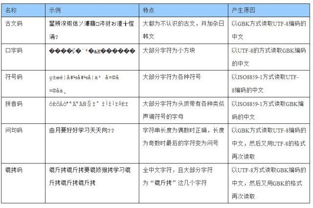

# 代码编写规范

阅读优秀的代码，可以学习到别人的良好的编程习惯或者编程思想，使自己进步。当然，还是要记得货比三家！

## 文件编码问题

常见的编码有 GBK、GB2312、Unicode 等。

有些时候打开文件或者应用程式遇到乱码的情况很可能就是由于编码问题。

视频：[文字频频乱码，这背后是显卡的扭曲还是规则的沦丧？ - 哔哩哔哩](https://www.bilibili.com/video/BV1ai4y1x7Uz)

由于历史上的原因，Windows 为兼容较旧的应用程序，不同版本的 Windows 默认采用不同的编码。比如简体中文是 GBK，繁体中文使用 Big5 等等。

这是因为，如果采用较新的 Unicode 编码，会导致打开使用如 GBK 等编码的程序时出现乱码（程序中用到的字符被硬编码进了可执行程序中）。为了保持兼容性，Windows 采取在对应地区使用对应编码的方式，这样可以保证大部分程序运行不出问题，但是会导致编程过程中一些奇怪的问题。

在编码、写文件时，**请使用 Unicode 编码**，它更为通用，使用范围更广泛。

> Windows 的记事本貌似很智能，可以推断出文件的编码，如果接收到的文件打开是乱码时，可以用记事本打开并将内容复制出来，或以需要的编码保存。
>
> Visual Studio Code 也能自动推断编码类型，但需要手动操作。

**需要注意**，当以错误的编码打开文件时，如果再次保存，那么丢失的信息将无法恢复。所以请留意是否以正确的编码打开了文件。

这里有一个表格，总结了常见乱码的原因：

| 名称   | 示例 | 特点 | 产生原因 |
| ------ | --- | --- | --- |
| 古文码 | `鐢辨湀瑕佸ソ濂藉涔犲ぉ澶╁悜涓?` | 大都为不认识的古文，并加杂日韩文 | 以 GBK 方式读取 UTF-8 编码的中文 |
| 口字码 | `����Ҫ�¨²�ѧϰ������` | 大部分字符为小方块 | 以 UTF-8 的方式读取 GBK 编码的中文 |
| 符号码 | `ç”±æœˆè¦å¥½å¥½å­¦ä¹ å¤©å¤©å‘ä¸Š` | 大部分字符为各种符号 | 以 ISO8859-1 方式读取 UTF-8 编码的中文 |
| 拼音码 | `ÓÉÔÂÒªºÃºÃѧϰÌìÌìÏòÉÏ` | 大部分字符为头顶带有各种类似声调符号的字母 | 以 ISO8859-1 方式读取 GBK 编码的中文 |
| 问句码 | `由月要好好学习天天向??` | 字符串长度为偶数时正确，长度为奇数时最后的字符变为问号 | 以 GBK 方式读取 UTF-8 编码的中文，然后又用UTF-8的格式再次读取 |
| 锟拷码 | `锟斤拷锟斤拷要锟矫猴拷学习锟斤拷锟斤拷锟斤拷` | 全中文字符，且大部分字符为“锟斤拷”这几个字符 | 以 UTF-8 方式读取 GBK 编码的中文，然后又用 GBK 的格式再次读取   |

有一个万能的解决方案，即**用英文**写代码、写注释，因为几乎所有常见编码格式对于 ASCII 字符的编码都是一致的。

拓展阅读：[字符集编码 定长与变长 - 博客园 (cnblogs.com)](https://www.cnblogs.com/yelongsan/p/6290206.html)

更多相关信息请自行查阅。

## 给自己的代码良好的注释

写代码的时候记得添加一些注释。良好的注释可以**方便自己和别人**阅读和修改代码。

不必要事无巨细，在关键部分给出提示即可。

通常，对于一个函数应该写明其具有的功能、函数各个参数的意义；对于变量要有对其作用的介绍。这样性质的注释一般写在函数或变量的**声明**处附近。而对于函数的定义部分也最好有相应的解释，可以告诉读者某行或某段代码实现了什么事情、或者为什么这样写。

> 很多编辑器、IDE可以识别到这些注释，并在鼠标悬停在它们的调用上时显示出函数的原型和注释，很是方便。

函数、变量名本身也应该体现一定的意义。如果得当，那么代码则具有**自述性**（self-explaining），而不必要额外再写注释了。

不建议用中文拼音为符号命名，更不要用中文缩写，因为中文的缘故，同音词很多，相同拼音首字母的词语更多，别人很难联想到具体是什么词语。既然是用26个英文字母编程，那么也建议使用英语给变量起名。

> 起变量名在一定程度上也需要一定的英语考究，比如一些词虽然意思相近，但其中的一个会比其他的更合适。

另外，再次强调编码问题！不然自己辛辛苦苦写的注释可能就没了……

## 变量/函数命名

养成良好且规范的**变量/函数命名**方式和习惯。

**函数**、**变量名**主要有下划线法、驼峰法等，比如`find_first_of()`、`namedWindow()`等。

**宏名**和**枚举名**（其实枚举就可以视作一种宏定义）一般采用全大写+下划线，比如`BGR2GRAY`、`MAX_LENGTH`、`BLUE`等。

不同的语言有着不同的命名习惯，比如 Python 倾向于使用下划线法命名变量，而 Java 倾向于使用驼峰命名法。

一般来说，函数、局部变量名、全局变量名、宏名等，应该采用**不同的命名法**以区分彼此。

变量名也应具有一定的**意义**，比如`tmp`、`temp`一般表示临时变量，`i`、`j`、`k`等一般用作迭代，`cnt`一般用来计数。

## 缩进问题

注意代码的缩进，良好的缩进便于阅读代码的层次，也方便看出错误。而如 Python 这种语言，则对缩进的要求很高，如果缩进有问题，则会直接导致执行出错。

很多代码编辑工具有自动格式化的功能，可以帮助你轻松完成这件事情，可以自行了解如何使用这项功能。

由于不同国家或个人的缩进习惯不一样，一级缩进（或者说一个Tab）可以是 2 / 4 / 8 个空格。因此**不要将空格（Space）和缩进（Tab）混用**，这样可能会导致显示出来的代码层次变得混乱、难以阅读。
