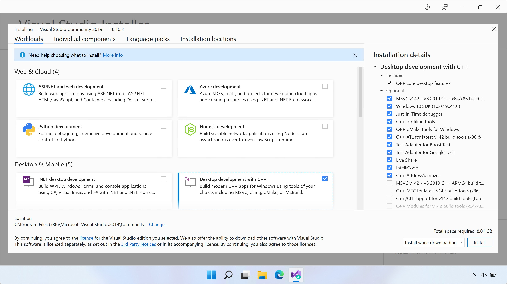

# 编译运行第一个 C/C++ 程序

## C/C++ 代码如何变成程序？

在之前的章节中我们说到，可执行程序的本质就是一连串二进制机器码。C/C++ 代码写成的程序要想执行，一般是需要通过编译器，直接翻译为机器指令来执行的。

> 不同于 C/C++，其他的语言可能会采取解释执行的方式，即编译器不会将程序的源代码编译成机器码来执行，而是编译到一种介于源代码和机器码之间的形态。

在“编译”过程中，一般又可以分为一下若干步骤。

- 预处理器对代码进行预处理，如条件编译、`include` 指令、宏展开等等操作都是在这一步执行的。

- 预处理的代码经过分析、处理，变为机器能理解的指令，最后生成“目标文件（Object File）”。

“目标文件”还不能直接执行，因为代码可能会调用外部的代码，因此接下来还需要根据这些调用，寻找相应外部代码的所在，比如外部的变量、函数等，统称为寻找外部符号。这一步叫做“链接（Link）”。假如要链接到的是库文件中的代码，则会分为分为静态链接和动态链接。

当然，在比较大的工程里面，我们的代码通常会分在不同的源代码文件里面。在编译过程中，每个源代码文件都是一个独立的编译单元，都会生成一个目标文件。在这个文件中（通过声明）使用到的符号，如果未在这个单元中找到，那么就是“外部符号”。链接器需要根据“外部符号表”去寻找这些符号的所在。

> 将工程分为多个文件编译，不仅方便阅读和修改，更能节省编译的时间——每次重新编译时，未修改的文件就不用重新编译了，只需要编译修改过的部分，再重新执行链接操作即可。

如果在其他目标文件中以及库文件中都没有找到对应符号的**定义**，那么这个被使用到的符号就是“未定义引用（undefined reference）”。

如果没有未找到的符号，那么链接器就可以整合这些代码，着手生成最终的可执行文件了。不同目标文件中的指令以及静态链接的指令会复制进来，动态链接的库文件会在可执行文件执行时被加载到内存中。

如果执行时，找不到或者缺失动态链接库的文件，那么程序将无法执行。

## Windows 

### Visual Studio 

针对 Windows 用户，我们先介绍安装 Visual Studio 的方法。Visual Studio 是一个完备的 IDE，也就是，提供编辑代码和编译、构建代码等一系列功能。

笔者个人一开始并不喜欢 Visual Studio，觉得它过于庞大和复杂，配置启动项也比较麻烦，不易学习和掌握。但是随着学习的深入和观念的转变，发现 Visual Studio 还是最适合新手的，因为安装过程十分简单，而选择 CMake 作为项目构建管理工具会使得项目的配置过程轻松很多。

> 读者也可以选择只安装 Visual Studio 的命令行工具，这会在“搭建命令行工作环境”中进行详细介绍。

- 打开浏览器，访问 [visualstudio.microsoft.com](https://visualstudio.microsoft.com/)，选择 Visual Studio -> Community 社区版（社区版是免费的），下载完成后直接运行即可。

    【2021/7/9】由于最近国际形势紧张，链接访问多有不畅，笔者将需要下载的文件的一份拷贝放在了微云上，链接：[share.weiyun.com/wGvadaSF](https://share.weiyun.com/wGvadaSF)。

     

- 运行下载好的程序，需要一段时间配置安装器，配置好后，一般会直接进入选择“工作负载”的界面。这里我们只需**勾选“C++ 桌面开发”套件**。注意到，界面右下角提示安装需要 8 GB 的磁盘空间，如果有必要，可以更改 Visual Studio 的安装路径。之后确认即可，接下来只需等待下载安装完成。

    

**至此环境就配置好了**。接下来，我们要找一个存放我们写代码的地方。在计算机中新建一个文件夹，里面新建一个名为 CMakeLists.txt 的文本文档。

打开 Visual Studio，选择打开现有文件夹，选择刚刚新建的这个文件夹，确定即可。

然后就可以开始写代码了。

我们可以在 Visual Studio 的“解决方案资源管理器”中，新建一个 C++ 源文件。

> 也可以在刚刚建立的文件夹中直接新建文件（方法：先在资源管理器中选择“显示文件后缀名”，然后新建一个文本文档，默认的名称一般为“**新建文本文档.txt**”，我们将名称改为“***某文件名*.cpp**”）。

在 Visual Studio 中的“解决方案资源管理器”打开 CMakeLists.txt，修改其中内容——比如源代码文件叫 hello.cpp，我们要添加这样的语句：

```cmake
add_executable(hello hello.cpp)
```

编辑好后保存即可。语句中的“`hello`”是“目标名”；“`add_executable`”表示我们要生成一个可执行文件，而目标名就是最后生成的可执行文件名。目标名可以自定义。“`hello.cpp`”表示要生成这个目标所需要的源文件。

不出意外，执行完上述操作后，我们就能在界面上方的绿色箭头框的下拉菜单里找到刚刚的目标“hello”。这是选择启动项。

> 启动项，即我们要运行的项目。它一般是我们在 CMakeLists.txt 中定义的可执行文件目标。

要启动（launch）一个启动项，我们需要先生成（或者说构建）这个项对应的目标，也就是常说的编译链接。不过不用担心，你**只需要点击绿色箭头**，这一切都会自动完成。

如果，我们想**加入新的 C++ 源文件**，就只需重复上边的操作。比如，我们编写了一个新的程序，存在名为“bye.cpp”的文件里。这时，我们就需要修改刚刚的 CMakeLists.txt 文件，**确保它是下边的样子**。（新建一个文件时，Visual Studio 会弹出是否将其添加到现有目标的对话框，我们选择取消）

```cmake
add_executable(hello hello.cpp)
add_executable(bye-bye bye.cpp)
```

这样，我们的整个项目，就有了如上**两个生成可执行程序的目标**。

需要注意，保存 CMake 配置文件后，我们需要在下拉框里选择对应的启动项，才能运行对应的程序。

## macOS

我们使用 macOS 来介绍如何使用命令行界面编译单个 C++ 源文件为可执行程序。

首先，需要安装编译器。Apple 的 XCode 提供有实用的命令行工具。在程序列表中找到“终端”，执行以下命令：

```bash
xcode-select --install
```

安装完成后即可使用命令行编译器了。

在某目录下以纯文本形式保存 C++ 程序的源代码，并切换到工作路径。注意，将命令中的“path/to/your/cpp/file”替换为实际的路径。

```bash
cd path/to/your/cpp/file
```

假设源代码文件名为“src.cpp”，则我们可以使用如下命令编译、链接生成可执行程序“test1”。

```bash
c++ src.cpp -o test1
```

之后，在命令行运行生成的可执行程序：

```bash
./test1
```

## Ubuntu

在终端中，使用包管理器 APT 安装构建所需要的命令行工具：

```bash
sudo apt install build-essential
```

其余步骤与 macOS 类似。
