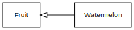
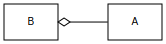
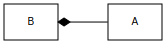
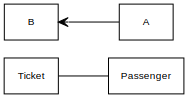
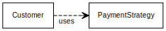
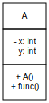

# UML 类图

这篇文章介绍如何画UML类图（class diagram），用来表示类之间的包含、继承关系等。

参考链接：[看懂UML类图和时序图 — Graphic Design Patterns (design-patterns.readthedocs.io)](https://design-patterns.readthedocs.io/zh_CN/latest/read_uml.html#id3)（GitHub仓库地址：[me115/design_patterns: 图说设计模式](https://github.com/me115/design_patterns)）

为了应付日常生活工作的要求，我们需要了解类之间的关系在UML中是如何表示的。

下面是从上面网站搬运过来的示例图：

- 车的类图结构为`<<abstract>>`，表示车是一个抽象类；
- 它有两个继承类：小汽车和自行车；它们之间的关系为**实现**关系，使用**带空心箭头的虚线**表示；
- 小汽车为与SUV之间也是继承关系，它们之间的关系为**泛化**关系，使用**带空心箭头的实线**表示；
- 学生与班级之间是**聚合**关系，使用**带空心菱形的实线**表示；
- 小汽车与发动机之间是**组合**关系，使用**带实心菱形的实线**表示；
- 学生与身份证之间为**关联**关系，使用**一根实线**表示；
- 学生上学需要用到自行车，与自行车是一种**依赖**关系，使用**带箭头的虚线**表示；

## 类之间的关系

| 关系     | 解释                                                         | 举例说明                                                     | 图例                                                         |
| -------- | ------------------------------------------------------------ | ------------------------------------------------------------ | ------------------------------------------------------------ |
| 泛化关系 | 泛化 (generalization)，也可以说是一般的**继承**关系，即两个对象之间为"is-a"的关系 | 西瓜是水果 |  |
| 实现关系 | 也可以说是“接口继承 (Interface Inheritance)”，即从抽象类继承而来 | “车”是一个抽象概念，只有像“汽车”、“自行车”才能生成具体的对象 |  |
| 聚合关系 | 聚合 (aggregation) 表示整体由部分构成的语义；不同于组合关系的是，整体和部分不是强依赖的，即使整体不存在了，部分仍然存在 | 一个部门由多个员工组成， 部门撤销了，但人员不会消失；如图表示A聚合到B上 / B由A组成 |  |
| 组合关系 | 组合关系 (composition) 是一种强依赖的特殊聚合关系（强聚合关系）：如果整体不存在了，则部分也不存在了 | 公司不存在了，部门也将不存在了；如图表示A组成B / B由A组成 |  |
| 关联关系 | 描述不同类之间**静态的**、天然的结构关系 (association)，通常与运行状态无关，一般由常识等因素决定，因此是一种“强关联”的关系 | 用一条直线表示，默认不强调方向，表示对象间相互知道；若强调方向，如图表示A知道B，但B不知道A |  |
| 依赖关系 | 描述一个对象在运行期间依赖另一个对象的关系 (dependency)；是一种**临时性的**关系，通常在运行期间产生，并且可能随着运行发生变化 | 如图表示A依赖于B |  |

## 使用 yUML

使用 yUML 画类图：

| 类型                              | 代码                                                         |                             示例                             |
| --------------------------------- | ------------------------------------------------------------ | :----------------------------------------------------------: |
| 类                                | `[A]`                                                        |                                                              |
| 带详细信息的类                    | <code>[A&#124;- x: int;- y: int&#124;+ A();+ func()]</code>  （不同区域用竖线隔开） |  |
| 单向箭头                          | `[A]->[B]`                                                   |                                                              |
| 双向箭头                          | `[A]<->[B]`                                                  |                                                              |
| 连线                              | `[A]-[B]`                                                    |                                                              |
| 聚合（Aggregation）               | `[A]+-[B]`或者`[A]<>-[B]`                                    |  |
| 组合（Composition）               | `[A]++-[B]`                                                  |  |
| 继承（Inheritance）               | `[Fruit]^[Watermelon]`                                       |  |
| 接口继承（Interface Inheritance） | `[<<abstract>> Vehicle]^-.-[Car]`,  `[<<abstract>> Vehicle]^-.-[Bicycle]` |  |
| 依赖（Dependencies）              | `[Customer]-.->[PaymentStrategy]`                            |  |
