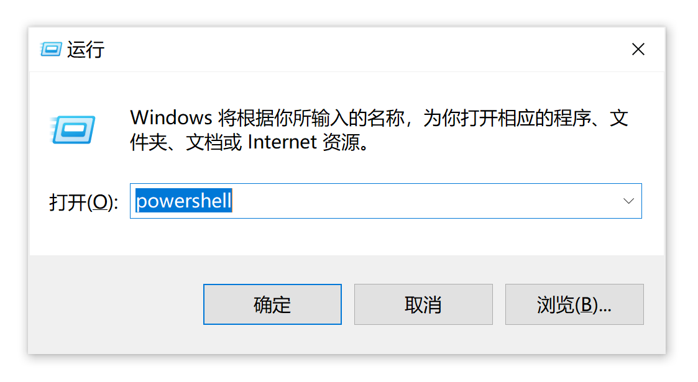
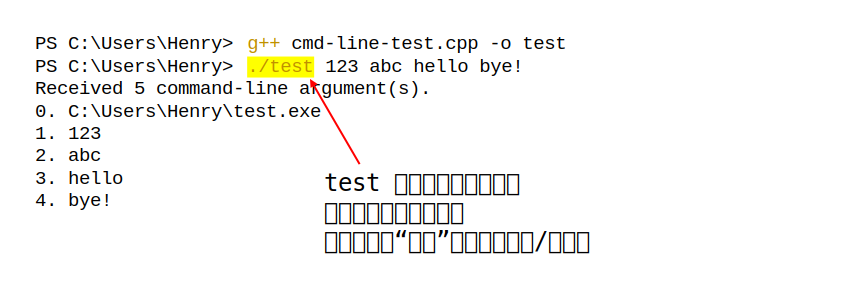

# 命令行入门

## 什么是终端？

最初，我们可能需要通过连线或者拨动开关等方式来，才能对计算机进行编程等操作。后来，人们发明出通过键盘操作计算机的方式，计算机则通过打字机向用户显示计算的结果；再后来，打字机变成了可以显示字符的屏幕。这一套键盘和显示设备等就称作“**终端**（Terminal）”，用户可以通过终端向计算机输入数据，终端也可以向用户显示计算结果。简单地说，终端也就是用户与计算机交互的设备。

再后来的一些终端不但可以显示文字，而且可以显示矢量图形和位图。随着计算机的发展，如今我们和计算机交流的方式变成了液晶屏幕、键盘、鼠标等，**专门的**计算机终端已经很少见了。现代的操作系统中的“终端”一般为**虚拟终端**（也称作“终端模拟器”）。输入系统仍是键盘，输出系统则为液晶屏幕。

## 为什么要学习命令行？

有一些程序**只能**通过命令行执行（常称作“命令行”程序）；也有些工作，通过命令行操作计算机的**效率可能会更高**；而作为程序员，则**可能经常会使用命令行**操作计算机。

但是我们也不必盲目崇拜命令行操作。对于很多任务，很可能有除命令行之外更高效的操作方式。

## CLI 程序

CLI（Command-Line Interface），即“命令行界面”。我们刚开始编程时遇到的很多“程序”，都属于 CLI 程序，也就是说，只能进行文本输入输出的程序。

CLI 程序获取用户在终端上的输入，并以文本形式将自己的信息输出在终端上。而我们目前计算机上见到的，大多数都是图形界面（GUI，Graphics User Interface）程序，这些程序**通过图形化的界面**与用户交流——获取用户的输入，以及输出信息给用户。

**虚拟终端**就是一种图形化程序，它模拟传统的终端，与 CLI 程序交流。

由于只和字符打交道，一般情况下，CLI 应用程序的开发成本和难度比较低。

## 什么是命令？

如图为一条命令：由**若干以空格相间的字符串**组成。这些字段统称**命令行参数**。注意：每一字段间至少需要有一个空格。

下图中的“`gcc`”“`hello.c`”“`-o`”“`hello`”即为四个命令行参数。


> 如果你不明白这个命令，别着急，我们会在“命令行工具”中讲到它。

如果一个参数中含有空格，我们需要用引号将其包裹起来，比如：

```bash
process_name Tom Lucy "Jane Doe"
```

### 命令行参数的一个惯例

再看一条命令：

```sh
apt list --upgradable
```

这里的“`list`”“`--upgradable`”都是传递给“`apt`”程序的参数；更进一步讲，带有横线的“`--upgradable`”是用来修饰“`list`”命令的。

观察上一条命令例子中的“`-o`”和本例中的“`--upgradable`”，前者前边有**一根短横线**（连字符），后边只跟了**一个字母**（通常可能为某单词的首字母）；后者前边有**两根短横线**，其后跟了一个**完整的单词**。这是命令行参数的一个惯例。

下面这个命令里，“`-Syu`”中的“`S`”“`y`”“`u`”各有含义，且小写的“`y`”“`u`”为修饰“`S`”命令的参数。

```bash
pacman -Syu
```

下面这个命令里的“`cvf`”也是类似的道理，三个字母分别指明了操作的三个属性。

```bash
jar cvf app1.jar app1
```

## ⚡ 补充：什么是操作系统？

操作系统，负责**调度计算机的资源**，使用户**更方便的使用计算机**。

> 苹果（Apple）公司生产的计算机，一般称作 Mactonish，预装的系统称作 macOS，也叫 OS X，它和苹果的诸多其他设备所使用的系统，都是从 Darwin 系统开发出来的。而 Darwin 又是从 Unix 系统演变过来的。
>
> 大部分厂商（OEM）出产的计算机都会预装 Windows 系统。
>
> 少数会预装 Linux **内核**（Kernel）的系统，Linux 是一个操作系统内核的名字，其不能提供实际使用的需要，需要安装一些**工具**才能做一些实际的事情。它还需要安装**桌面环境**，才能具有图形化的界面。常见的 Linux 内核的系统有 Debian、Ubuntu、CentOS 等，这些统称为 Linux 发行版，他们会包括一些必要的基础工具以及桌面环境。

由于 Unix 和 Linux 的操作很相近（至于他们的渊源暂时不解释），所以有时候用“\*nix”来统称两种系统。

参考链接：

- Why Is macOS Software Sometimes Labeled “Darwin”?  - https://www.howtogeek.com/295067/why-is-macos-software-sometimes-labeled-darwin/


## 什么是 Shell？

Shell 可以视作一个程序，它负责一些比较基础的、和操作系统打交道的事情。

打开终端后，其中会自动运行着 **Shell** **程序**。

在终端键入命令后，会交给 Shell 进行**解析和执行**。

Windows 常用的 Shell 有 cmd 和 PowerShell，\*nix 系统上常用的有 bash 和 zsh。

一般，关于命令行的资料多为针对于 \*nix 系统的，其次是针对 Windows 下 cmd 的。专门针对 PowerShell 的教程可能不是很多。另外，很多在 Unix 上的命令，在 PowerShell 上是不通用的。

如果想要在 Windows 上运行类 \*nix 环境，可以安装虚拟机软件以使用真正的 Unix / Linux 系统，也可以安装 MSYS2。

接下来，本教程尽量使用 Win32 / \*nix 平台下通用的命令，但为了避免一部分问题，我们建议读者在类 \*nix 环境下学习本教程。但这不意味着我们建议推崇 \*nix 环境。

链接：【转】不要盲目崇拜 \*nix 下的开发环境：https://www.cnblogs.com/feichengwulai/articles/3628014.html


观察图像，可以大致了解 Shell 处在整个计算机的哪一个层级。是不是像一个壳（shell）？


## ⚡ 补充：目录和文件

### 目录和文件的表示

文件、目录都有一个名字，比如“apple”可以是一个文件夹的名字，也可以是一个目录的名字；

一个目录下可以有多个文件或目录；

通常，用“`.`”表示**当前目录**，“`..`”表示**上一级目录**

Unix 一般用正斜杠“`/`”（forward slash）分割路径，Windows 一般用反斜杠“`\`”（backslash）。

举几个例子：

- 以“`/usr/local/`”为例，最开始的“/”表示**根目录**，即根目录下的“usr”目录下的“local”目录。
- 以“`files/1.txt`”为例，它表示（当前目录下）files目录中的名为“1.txt”的这个文件。也可以写作“`./files/1.txt`”。
- 以“`1.png`”为例，它表示（当前目录下）的名为“1.png”的文件。

### 文件的分类

文件可以分为**可执行文件**和普通文件。（其实目录也可以算作一种文件）

可执行文件（名）可以作为交给 shell 的命令的第一项。

更多关于文件的内容暂时不在这里展开。


## 打开计算机上的终端（虚拟终端）

### Windows 下打开终端（虚拟终端）

（其中一种方法）按下“Windows 徽标键 + R”打开“运行”，输入“powershell”，然后按下“Enter”键或者点击“确定”。




接下来，观察终端中的内容：

“`C:\Users\Henry`”表示当前所在的工作路径：“C盘”下的“Users”目录下的“Henry”目录

通常，打开终端后所在的目录为用户（User）的“**家目录**（Home）”，可以理解成**用户存放个人文件的大本营**。

因此，也不难理解“`C:/Users/Henry`”表示的就是“Henry”这个用户的文件夹。

> 需要注意的地方：
>
> 你可能会注意到，我们在“运行”窗口中输入的“powershell”其实是一个程序名。但实际上我们看到的是，出现了一个窗口，里面运行着 PowerShell。
>
> 这是因为当启动一个文本界面程序时，Windows 会自动将其依附到一个 **Win32** **控制台**上。
>
> Windows **默认的终端**为“Win32 控制台（Win32 Console）” 。
>
> 在过去，一般用户操作的叫做“终端”，而管理员操作的叫做“控制台”。至于现在，控制台和终端基本没什么区别了。

### Ubuntu 下打开终端（虚拟终端）

在程序列表中寻找“终端”应用；或者尝试按下“Ctrl + Alt + T”。


接下来，观察“`nan@Nan-Machine:~$`”这个字符串中不同的字段：

| 字段              | 解释                                                         |
| ----------------- | ------------------------------------------------------------ |
| `nan@Nan-Machine` | “nan”是当前终端登入的用户名， “Nan-Machine”为所登入计算机的名称。 |
| `~`               | 表示当前所处的路径。Unix 下用“~”表示用户的**家目录**         |
| `$`               | 表示当前的权限为普通用户权限，这时不能访问一些系统文件和目录，当为“`#`”时表示处于“超级用户（Super User）”模式。关于如何执行需要提权的命令，将在稍后解释。 |

### ✏️ 练习 1——初识命令

尝试自行解释下面这行命令的含义：

```bash
echo "hello!"
```

然后在终端中输入这条命令，观察终端的反应。注意，命令中的引号“`"`”为英文引号，输入时需要注意。

## 标准输入输出

对于一个文本界面（CLI）程序，其输入，除了命令行参数，还有**标准输入**，默认会从终端读取。

程序的标准输出，默认显示 / **打印**（print）在控制台上。

### 输入输出重定向

通过输入输出重定向，可以将程序的标准输入**重定向**为“从文件读取”，或者将程序的标准输出重定向为“写入到文件”。

Shell 提供输入输出重定向的功能，一般可以使用“`<`”和“`>`”符号。详情参见下面的练习。

### ✏️ 练习 2——输出重定向

在终端依次输入如下命令：

```bash
echo "hello!" > hello.txt
cat hello.txt
```

观察执行命令后的输出。

## 管道

通过管道，可以将一个命令执行后的**标准输出**，作为另一个程序的**标准输入**。

在 Unix 系统上常用的 Shell 中，使用“`|`”符号表示管道。

如：`FirstProgram | AnotherProgam`

### ⚡ 补充：正则表达式

正则表达式用来匹配（match）符合一定规则的字符串。

参考资料：第 6 章 正则表达式 – 现代 C++ 教程：https://changkun.de/modern-cpp/zh-cn/06-regex/index.html


### ✏️ 练习 3——管道

观察执行每条命令后的输出：

```bash
echo "Hello Cello" > text.txt
cat text.txt
grep "ello" text.txt
cat text.txt | grep "ello"
```

注：对于 PowerShell，需要使用下面的命令：

```powershell
echo "Hello Cello" > text.txt
cat text.txt
Select-String -Path text.txt -Pattern "ello"
cat text.txt | Select-String -Pattern "ello"
```


## 命令替换符

将另一个命令的输出，替换到另一个命令的某个位置。

通常使用 `$()` 符号来实现命令替换；这种方法比较通用，并且比较明显；

在 \*nix 系统上，也有用反引号（backticks）“\`”进行命令替换的，但是反引号不容易与一般引号区分，因此建议使用 `$()`。

常见的命令比如：

```bash
g++ test.cpp -o test $(pkg-config --libs --cflags opencv4)
```


## 续行符

在一行的结尾输入“`\`”，表示该命令尚未完结，需要**另起一行继续输入**。

## 控制序列、脱字符表示法、转义字符

在 ASCII 字符中，有一些字符，并不会 / 无法被终端**打印**出来。但他们通常可以让终端做一些事情，比如更改字体颜色、发出响声等。

**脱字符表示法**（Caret notation）是对 ASCII 码不可打印的控制字符的一种表示法。用一个脱字符（^）后跟一个大写字符来表示一个控制字符的ASCII码值。当终端遇到这些控制字符时，一般会以脱字符的形式显示给用户。

举个例子，键盘上的 ESC 键，在 ASCII 码中为第 27 个，其脱字符表示法为“`^[`”。要在终端中输入脱字符，通常是按住 Ctrl，并键入对应字符。

而在文本内容中，我们通常会用“转义字符（escaped characters）”的方式表示一些控制字符。顾名思义，转义字符，其表示的便不再是其本身的意思。转义字符通常以反斜线开始。比如：`\a` 表示响铃，`\n`表示换行等等。

> 更详细的关于转义字符的介绍，请阅读后续章节。

### 🧪 实验：控制终端输出文本的颜色

CLI 程序只能以文本形式将信息显示给我们，当信息量比较大时，我们就不容易阅读信息了。后来出现了彩色终端，程序可以通过向终端输出一些特定的字符，控制终端输出内容的格式。现在的（虚拟）终端一般能支持针对字体的颜色（color）、强度（intensity，可以理解成颜色的暗淡或高亮）、斜体、下划线等属性（attributes）的调节。

在终端中输入如下命令，观察终端的输出：

```bash
echo "^[[31m hello ^[[0m"
echo "^[[32m hello ^[[0m"
```

**注意**：“`^[`”为一个整体，是终端对 ESC 这个字符的表示，需要通过上一张幻灯片介绍的方式键入。

输出结果：


如果无法键入 ESC 字符，在 Windows 上可以尝试升级或更换所使用的**终端**。

而在 \*nix 中，可以给“echo”命令加一个参数“`-e`”，使其解析字符串中的转义字符，然后使用“转义字符”表示 ESC 字符。

```bash
ehco -e "\033[31m hello \033[0m"
```

如果实在无法输入字符，可以只观察一下图片中的示例即可。在之后的内容中会指引读者通过编程的方式输出“转义序列”。

有关彩色输出控制序列在此不过多介绍了，感兴趣的同学可以自行查找相关资料。


## 🧪 实验：编写自己的可执行程序

任务：在命令行中运行自己编写的程序，同时体验程序如何接收命令行参数。

这里我们采用 C++ 编写这个程序。代码会在下面给出。

如果尚未掌握基础的 C++ 知识（如何编译、运行），可以跳过实际操作过程，观察给出的程序的表现即可。

源代码：

```cpp
// cmd-line-test.cpp

#include <iostream>

int main(int argc, char* argv[]) {
    std::cout << "Received " << argc << " command-line argument(s).\n";
    for (int i = 0; i < argc; i++) {
        std::cout << i << ". " << argv[i] << "\n";
    }
    std::cout << std::endl;
}
```

输出结果：



图片的 `test` 是一个可执行程序，但 `test` 不是一个全局可用的命令，它只在当前目录下可用，因此我们采用如 `./test` 这样通过**路径**的方式来访问/执行它。有些时候，我们也会通过绝对路径的方式访问某个可执行程序，如：

```bash
C:/Users/Henry/test 123 abc hello
```

有时候，文件名中可能包含空格，这需要转义。或者，我们可以使用引号将整个路径括起来，像下面这样：

```bash
"/path/to/an/executable" 123 abc hello
```

> 至于如何让一个应用在全局可用，我们会在之后讲解“环境变量”。

## 如何执行需要提权的命令？

### Windows：运行提权的 Shell


如果看不到“🔎”按钮，可能是因为没有在任务栏中启用搜索按钮。

也有可能是因为关闭了 Windows 的“Windows Search”功能。

### \*nix：执行提权命令

在命令前加上 sudo 字样，然后执行，之后会要求输入密码。

注意，密码不会回显，输入完成后直接按“Enter”键提交即可。

## 使用其他的终端或者 Shell

当然，使用什么终端或者 Shell 是我们可以选择的。

不同的 Shell 可能会有不同的“行为（Behavior）”或者功能，但是他们的根本目的是一样的——执行命令操作计算机。

## 结语

现在，你只了解了基础的概念，如果要熟练掌握命令行，还需要了解一些常用的命令。

众多命令行工具的大门已经向您打开，如……

不一定需要记忆各种命令。可以准备一份速查表 / 备忘单（Cheatsheet），在需要时查阅。

## 参考资料

- [命令行界面（CLI）、终端（Terminal）、Shell、TTY，傻傻分不清楚？ - PRIN BLOG - printempw.github.io](https://printempw.github.io/the-difference-between-cli-terminal-shell-tty/)
- [脱字符表示法 - 维基百科](https://zh.wikipedia.org/wiki/%E8%84%B1%E5%AD%97%E7%AC%A6%E8%A1%A8%E7%A4%BA%E6%B3%95)

## 作业

1\. 我们刚刚只是在命令行中逐语句键入命令，但我们也可以将若干条命令存储在一个文本文件中。这个该过程称为编写 Shell 脚本。尝试通过编写 Shell 脚本新建名为 folder01 ~ folder10 的 10 个目录。

2\. 了解正则表达式；

3\. 阅读参考资料。
