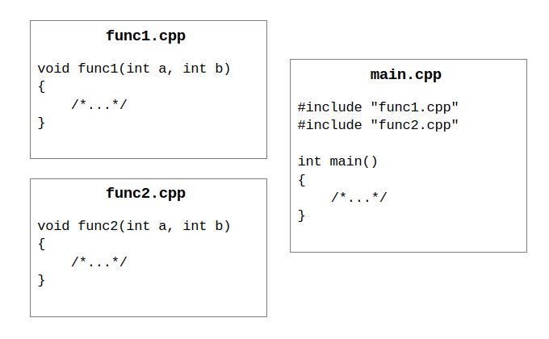
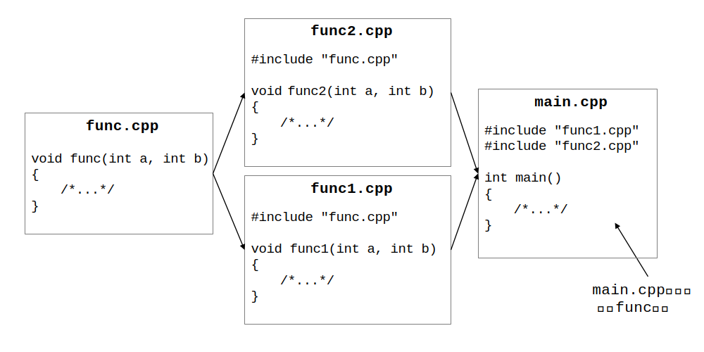
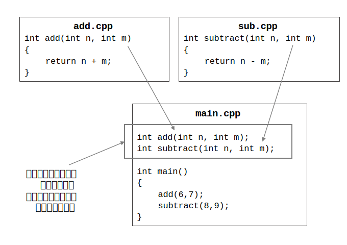
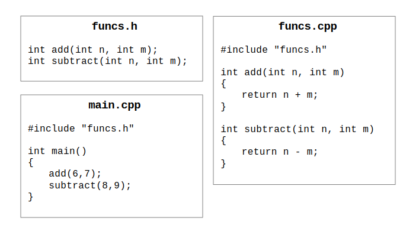
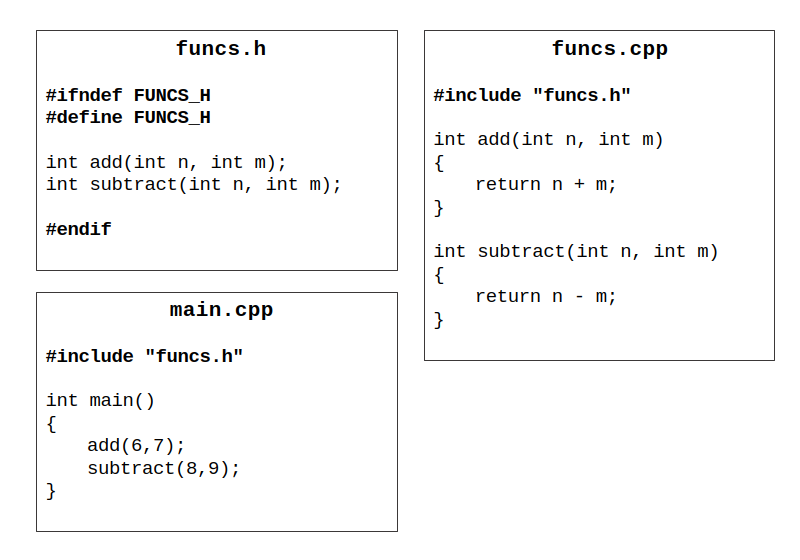

# C/C++ 多文件编程入门

## 引入

最开始，我们通常在一个 C/C++ 源代码文件里写下所有需要的代码；当要写一个新的文件要使用之前写好的功能的时候，就把之前的代码复制过来。

但是随着写的程序变得多、变得复杂，每次需要从更多的地方复制更多代码，而且代码文件的长度也越来越长，给维护和阅读都带来一定的麻烦；更重要的是，如果想要修改某一特定功能，那么所复制了这段源代码的地方都需要重新修改。

> 也会增加不必要的编译时间：单文件修改一个地方，其他的所有地方也不得不重新编译；重复的功能在每一个文件里都需要重新编译。

所以我们需要寻找一种方法来**避免重复**的代码。

## 预处理指令 `include`

在编译代码之前，编译器会先对代码文件进行预处理，这些命令通常以 `#` 开始。其中 `include` 命令就意味着把相应的文件内容复制到当前文件里。`include` 指令在搜索文件时有一定的顺序，这里暂时不过多展开。

## 重复定义

看似我们只需要将各个功能的代码写好放在不同的文件里，使用的时候再 `include` 对应的文件就好了，比如像下图这样：

这样的想法在只有一层包含关系时一般不会出现问题，但是一旦包含关系不止一层，就可能会出现同一个函数出现多次的重复定义（multiple definition）问题，比如下图所示的场景就会导致 `main.cpp` 中会有两个 `func` 函数：

尽管可以使用 `ifndef` 指令避免文件被包含多次，但是这种解决方法治标不治本，本质上还是把代码复制了一遍——虽然代码文件看起来简单了，但是每修改一次被包含的文件，虽然并没有修改包含这个文件的其他文件，但是经过预处理后，这些文件还是会发生变化。于是，这些没有改变的部分也会被重新编译，造成不必要的时间和资源浪费。

## 链接、接口、头文件和源文件

那我们想要在程序中调用其他写好的内容具体应该怎么做呢？

把写好的每一个功能想成一个个组件，那么一个程序就是由一个个组件拼接而成，所以我们只需要将每一个组件准备好，最后就进行一个拼接的操作即可。

具体来说，这些“组件”包括变量和函数的声明和定义。每一个 C++ 源代码文件是一个编译单元，其中包含若干定义。最终目标的生成，就是将这些文件拼合起来。当某个源代码文件发生了更新，只需要重新编译发生变化的文件，再执行一次“拼合”的操作即可。

这个操作就是“链接”——链接器需要找到程序中使用到的各个符号的位置，将他们联系起来，即，得知彼此的所在。

在某一个源文件中，如果需要使用某个符号（变量、函数、类型等），需要在使用前具有该符号的声明。

这不难理解，比如我们需要使用一个函数，一定需要知道这个函数的参数列表以及返回值类型，而不必知道函数的具体定义。函数的具体定义可以在其他文件中实现。因为只要在最后经过上述“拼合”的操作，调用者就能够找到被调用的对象，程序即可正常运行。

比如，在某个 C++ 源代码文件（编译单元）中使用了某名为 `func` 的函数，**只需要**在当前文件中该函数的调用处之前能够找到 `func` 函数的**声明**（函数名 + 参数、返回值类型），也就是这个函数的**接口**，就能够通过**编译**。

而在编译之后的**链接**阶段，编译器就会去寻找对应的函数**定义**，如果没有找到，就会出现“未定义引用（Undefined Reference）”的错误。

下图中，`main.cpp` 中使用的 `add` 和 `sub` 函数分别在两个文件中定义，在 `main.cpp` 中仅包含两个函数的声明，需要和相关文件链接之后才能生成可执行文件。

当一系列函数（还有比如结构体、类的声明，模板等）的声明比较多时，我们可以把这些声明单独拿出来放在一个文件里，像一个清单一样，称之为**头文件**（headers）；对于这些函数的实现则放在另一个文件里，也就是源代码文件（source files）。

因此，当别的程序需要使用对应的功能的时候，直接`include`需要的“清单”即可。

下面是一个使用头文件存储声明的简单的例子：

即，将 `add` 和 `subtract` 的声明放在一个单独的头文件（`funcs.h`）中，而用于实现这些函数的源代码文件（`funcs.cpp`）和使用这些函数的文件（`main.cpp`）都需要引用这个头文件。

两个 `cpp` 文件都能正常通过编译生成对应的目标文件 `funcs.o`、`main.o`。最后将这些的目标文件链接在一起，即可生成最后的可执行程序。

## 头文件保护

但是，还需要避免出现多次声明的问题，因此要确保头文件只被包含一次，需要设置头文件保护（header guard）。

一般可以使用条件编译指令来实现头文件保护。基本原理如下：

- 在一段内容中使用一个宏定义，用于标记该内容是否被引用
- 为该段内容使用条件编译：检测是否已经定义该宏名，如果已经有定义，说明该段内容已被包含，则不再进行包含操作。

## inline 关键字

头文件中不能包含函数定义，虽然头文件保护过后只会被包含/复制一次，但当一个头文件**被多个源文件包含**时，在最后的链接步骤，就会找到该函数的多个定义，也就是“重复定义（multiple definition）”的错误。

我们可以将函数声明为 `inline`，即“内联函数”。如此，即便该函数在多个文件中被引用，进而出现在多个文件中，但是当最后这些文件被汇总在一起时，依然被视作同一个函数，因此不会出现重复定义的问题。

编程者需要确保内联函数的定义是唯一的，若出现多个对于某内联函数的定义，则为未定义行为，会发生不可预料的后果。

对于类，我们也可以直接在声明时定义成员方法，即类的内联成员方法。

> 当编程者为某函数声明添加 `inline` 关键字时，同时也暗示编译器，希望将此函数直接应用（展开）在调用处，而不是进行常规的调用，以减少调用时的资源开销。不过，现代主流编译器一般会自动判断是否对函数进行内联操作。

如确需要在多个编译单元中使用不同定义的同名函数，可以使用 `static` 关键字。这样，该函数便不会在链接阶段暴露于其他编译单元。在 C++ 中，推荐的做法是将这些函数置于一未命名的名字空间中。

## 头文件中应该包含什么内容？

总结一下，大概有这些内容可以出现在头文件中：

- 函数原型
- 结构体 / 类声明
- 模板
- 内联函数

## `include` 指令搜寻范围

使用双引号 `""` 时，编译器首先查找当前工作目录或源代码目录，然后再在标准位置查找。

使用尖括号 `<>` 时，编译器将在系统的头文件目录中查找。

## 参考资料

- http://c.biancheng.net/view/7672.html
- https://stackoverflow.com/questions/10876930/should-one-never-use-static-inline-function
