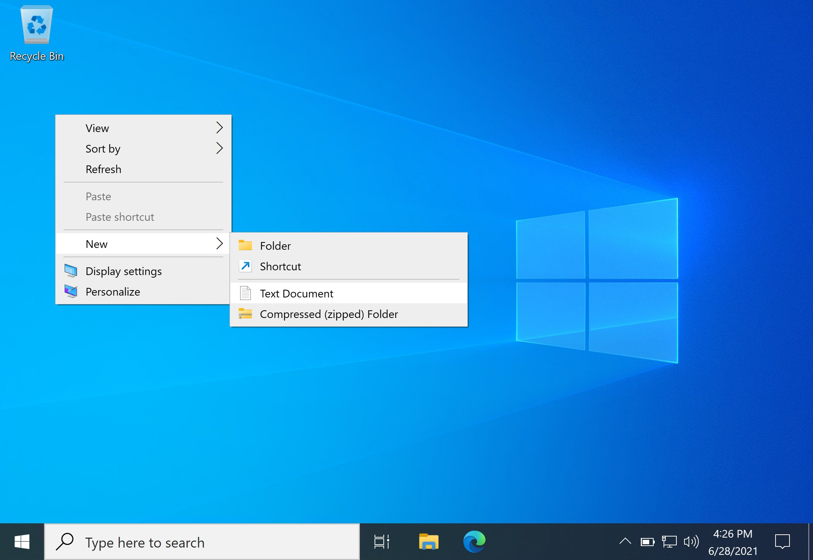
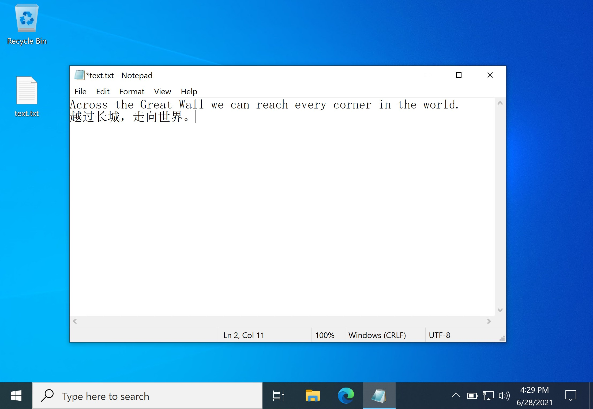
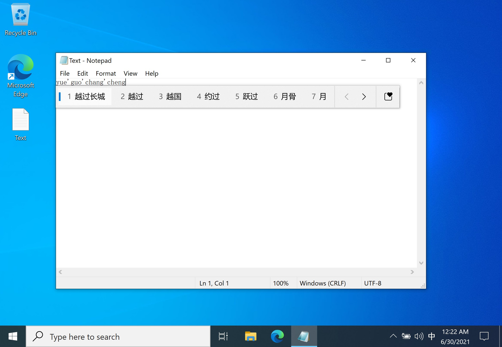
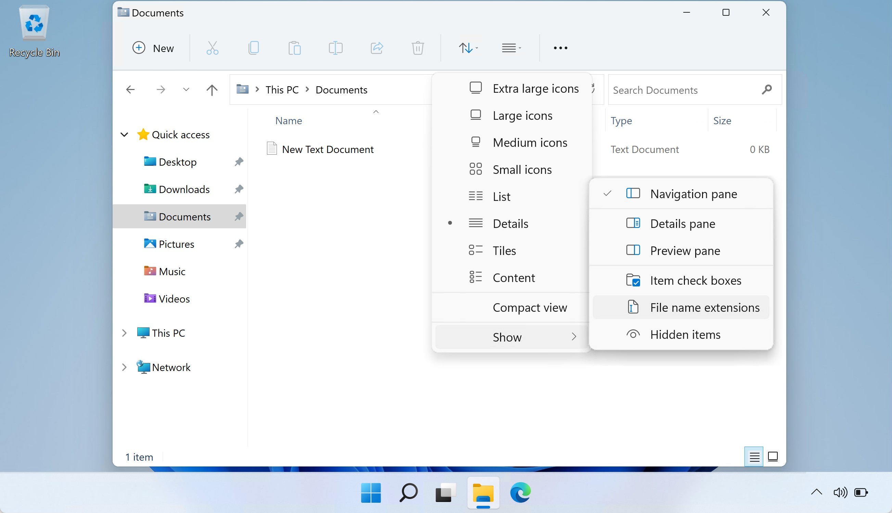

# 和计算机交互

对于最原始的计算机，我们可能需要通过拨动开关或者连接电线等方式，才能对计算机进行编程等操作。后来，人们发明出通过键盘操作计算机的方式，计算机则通过打字机向用户显示计算的结果；再后来，打字机变成了可以显示字符，甚至是矢量图形和位图的屏幕，也就是终端（Terminal）。

随着科技的发展，如今，我们和计算机交流的工具进化为了屏幕、键盘、鼠标等。而交流的方式，除了敲击键盘之外，也增加了点按、鼠标移动、触摸、体感等多种方式。

得益于计算机存储能力的提升和信息传递方式的改进，现在计算机不仅可以存储许多内容和资料，也可以存储多种多样的应用程序（Applications），有时也称为程序（Programs）。

所谓**程序**，即一系列操作计算机的指令，包括如何获取输入，进行何种运算，如何将结果展示给用户。这些应用程序由开发者（Developers）事先编写好，并以一种方式发布。编写应用程序的过程即为“编程”（Programming）。这些应用程序可以是直接被计算机执行的指令，也可以是需要通过其他程序解读才能执行的脚本。获取应用的平台一般称作“应用商店（Application Store）”或“应用市场（Application Market）”。

现在的计算机结构通常比较复杂，一般需要**操作系统**来作为用户和计算机之间的中介。操作系统负责调度计算机的硬件，与硬件沟通。可以将操作系统理解成最基础的程序，在操作系统上，我们可以运行其他的应用程序。这些应用程序通过操作系统提供的接口操作计算机。

用户可以通过计算机的硬件（输入设备）操作计算机，产生的信号会发送给操作系统处理，操作系统再将信息发送给应用程序，应用程序处理后，通过使用操作系统提供的接口，将结果输出在硬件上，最终为用户所知。

总的来说，操作系统负责**调度计算机的资源**，可以使用户**更方便的使用计算机**。

    用户 <-> 应用程序 <-> 操作系统 <-> 硬件

> 其实操作系统和硬件之间又有 BIOS（Basic Input / Output System），这个系统又会提供接口给操作系统使用。当然，应用程序也可以有供给其他程序使用的接口。

常见的操作系统有 Windows、OS X、各个 Linux 发行版（如 Ubuntu、Debian、Arch Linux、Manjaro 等）。不同操作系统上程序文件（可执行文件）的格式不尽相同。

> 苹果（Apple）公司生产的计算机，一般称作 Mactonish，预装的系统称作 macOS，也叫 OS X，它和苹果的诸多其他设备所使用的系统，都是从 Darwin 系统开发出来的。而 Darwin 又是从 Unix 系统演变过来的。而其他厂商（OEM）出产的家用计算机一般会预装 Windows 系统。
>
> 少数会预装 Linux **内核**（Kernel）的系统。Linux 是一个操作系统**内核**的名字。操作系统内核并不能满足用户实际日常使用的需要，需要安装一些**工具**才能做一些实际的事情。除此之外，还需要安装**桌面环境**，才能具有图形化的界面。常见的 Linux 内核的系统有 Debian、Ubuntu、CentOS 等，这些统称为 **Linux 发行版**，他们会包括一些必要的基础工具以及桌面环境。
>
> 由于 Unix 和 Linux 的操作很相近（至于他们的渊源暂时不解释），所以有时候用“\*nix”来统称两种系统。
>
> Why Is macOS Software Sometimes Labeled “Darwin”?  - https://www.howtogeek.com/295067/why-is-macos-software-sometimes-labeled-darwin/

## 输入输出设备

### 驱动程序

驱动程序（driver）也是一段程序，它通过翻译一个程序或者硬件的输出，使得该输出能够被另一个或另一些程序或硬件理解，从而使两者之间可以正常沟通。

我们的连接到计算机的外部设备，通常都需要驱动程序的存在，才能使硬件正常工作——即其能够被正确识别，且输出能够被正常读取（以及能够正确接收操作系统的控制）。

### 键盘

通常，按下键盘上的按键，其就会发送相应的信号。我们常用的键盘包含 0 - 9 阿拉伯数字、英文字母 A - Z、标点符号、控制按键等。键盘上有哪些按键、按键对应的字母或功能，称作键盘布局（Keyboard Layout）。

中国境内销售的计算机，一般和英美国家的键盘布局是相似的，有时也称作“QWERTY”键盘。而如法国、西班牙等国家，考虑到语言的使用习惯，其销售的计算机键盘按键所对应的字母可能并不是 A - Z 或是我们所熟悉的标点符号。

我们可以打开计算机上的记事本程序，然后按下键盘上的按键，观察屏幕上的输出。

### 鼠标

鼠标（mouse），因为其椭圆流线型的形状外加一条数据线，酷似生活中的小老鼠而得名。用户可以通过移动鼠标，从而移动电脑屏幕上的光标到想要的位置上，是一种输入设备。

鼠标一般至少具有三个按键：左键、中键和右键。其中中键有可能是滚轮，也有可能是集成了“中键”功能的滚轮（即，可点按）。三者通常并列在鼠标前端。

在桌面平台（desktop）里——笔记本、台式机等——中鼠标的常用操作：

- **左键单击**：快速按下并松开左键，可以**选定**一个操作目标，或者点击按钮
- **左键双击**：两次快速按下并松开左键，可以“**打开 / 执行**”操作目标如应用和文件夹等
- **右键单击**：快速按下并松开右键，可以打开一个操作目标的**选项菜单**
- **左键单击并拖动**：按下左键并保持不松开的同时移动鼠标，可以拉出选框框选多个操作目标（拖选）；也可以拖动窗口，也可以拖动选中的目标；拖动目标到其他位置可以实现移动或复制目标
- **拨动滚轮**：可以上下翻动页面

有时，移动设备也能连接鼠标，这时的鼠标操作可能需要类比触摸输入。

根据习惯，用户也可以在系统中设置，选择交换鼠标右键和左键的功能。

### 触摸屏

触摸屏常见于移动设备和一些可穿戴设备上，如智能手机、智能手表等。

针对触摸屏的操作，一般很少用到双击。总体来说，触摸屏的操作有如下逻辑：

- **点击**：选择一个目标，或者打开一个项目。
- 按下、停留一段时间后松开（**长按**）：打开操作目标的选项菜单
- **长按并拖动**：移动选中目标
- **滑动**：翻动页面
- **双指捏合**：缩小内容
- **双指张开**：放大内容

有些桌面式计算机也会配备触摸屏，其操作大致可以类比移动设备触摸屏的操作。

曾经的智能手机会在正面底部提供实体导航键。导航键一般包括三个按键，分别为“返回上一级页面”“回到主页面”“打开最近任务/打开当前页面的选项菜单”三种功能。这些按钮可能也会分为“长按”和“点击”两种操作，用来实现不同的功能。

现在的智能手机多为“全面屏”，其导航键也进化了为触摸手势。用户可以选择在屏幕底部显示导航栏的按键（虚拟导航栏），延续之前的操作习惯；也可以选择通过滑动屏幕底端对应区域，代替之前点按导航键的操作；也可以采用为全面屏设计的操作：

- 从屏幕底部快速向上滑动并松开：回到主页面
- 从屏幕底部向上滑动并停留：查看后台程序
- 在屏幕底部左右滑动：切换应用程序
- 从屏幕侧边向内滑动：返回上一级页面

> 所谓“主页面”，即用户进入图形界面所看到的最开始的页面，也称作“桌面”。桌面上一般会放置若干应用程序的图标，或者一些小工具；桌面式计算机桌面上可能还会放置有用户的文件。

### 触摸板

触摸板通常是为了代替鼠标操作，一般配备在笔记本电脑上，使其更加便携（不需要额外携带鼠标）。由于笔记本电脑属于桌面端，因此其操作不同于触摸屏。

- 单指轻触/点击：相当于鼠标左键单击。也可以按下整块触摸板（偏左部的区域）。有些旧式触摸板不支持触摸点击的操作，需要按下相应侧的按键。
- 单指滑动：移动鼠标指针的位置
- 点击一下并按住（轻触、抬起、再触摸）：相当于鼠标左键单击并拖动
- 双指轻触/点击：相当于鼠标右键单击。有时按压触摸板的右部（偏右下部分）也可以实现这个操作。有些旧式触摸板不支持触摸点击的操作，需要按下相应侧的按键。
- 双指滑动：相当于鼠标滚轮
- 三指轻触/点击：相当于鼠标中键点击。可能需要在系统中设置触摸板的手势。Windows 10 操作系统默认会打开“搜索”，需要用户手动修改。
- 双指捏合：缩小内容
- 双指张开：放大内容

Apple 生产的计算机的触摸板可能会采用两段式设计，其使用上又有不同，详情请参考相应产品的支持页面。

> 我们会在后面介绍网页和站点的概念。

## 图形界面

### 常见图标语义

在图形界面中，通常有这些语义。

- **按钮**：可以点击，触发事件：图标一般具有文字说明或着图形，我们可以根据这些内容联想语义：如一个“放大镜”形状的图标，可能意味着对当前内容进行“查找”操作；如同三个点的省略号形状的图标，可能代表点击后会有更多内容或选项展开。
- **文本框**：通常为一块区域，可以在其中输入内容；点击文本框将其选中后，其中一般会出现闪烁的**光标**，表示接下来输入的内容将会插入在此处。
- **窗口**：一个窗口为出现在桌面上的框体。一个窗口中可能会有若干按钮和文本框。通常一个应用程序可以创建一个或多个窗口，用来和用户交互（获取输入或展示信息）。应用程序使用过程中**弹出的窗口**（pop-up）一般用来向用户提示信息、请求确认等。

### 桌面环境

桌面环境（Desktop Environment）不仅提供图形界面，也包括一些基本的图形应用程序，如文件管理器、计算器等实用工具。

### 如何确定计算机使用的是什么操作系统？

大部分情况下，市面上购买到的家用计算机会预装 Windows 操作系统。Apple 生产的计算机会预装 macOS 系统。部分计算机会预装某种 Linux 发行版。

### 初识桌面（Windows 10）

#### 认识桌面图标

Windows 10 桌面环境：

如图所示的即为 Windows 10 系统的桌面。左上角有两个图标，上边的一个“桶”图标为“回收站（Recycle Bin）”，用户删除的文件会暂存在这里；下边的一个绿色流线型球状图标为**系统自带的浏览器**“Microsoft Edge”。

图片最下方的部分为“任务栏（Taskbar）”。任务栏主要有几个板块组成：

- 任务栏最左端的窗型图标为“**‘开始’菜单**（Startup Menu）”按钮，点击可以打开“‘开始’菜单”，以便**查看和启动其他已安装的应用程序**；

- “‘开始’菜单旁边的图标”为“Windows Search”搜索框，可以用来检索计算机上的内容；
- 随后为若干应用程序的图标，它们被固定在任务栏上，方便用户快速启动，也被称为“**快速启动栏**”；
- 任务栏的最右端包括一些**状态图标**，用来展示计算机当前的状态，或者正在后台（background）运行的程序；
- 此外还有日期时间、输入法等。

我们可以右键点击任务栏，对其进行一些设置，比如任务栏中显示的图标、任务栏在屏幕上的位置等。

#### 新建文件

接下来，我们尝试在桌面的空白处右键点击，这会弹出一个菜单。

我们可以选择“新建（New）”，这样便可以新建一个文件。我们尝试新建一个文本文档。这会使得桌面上出现一个“文档”形状的图标，其代表着我们新建的文本文档。

刚创建一个新文件时，图标下方文件名称处是一个待输入的文本框，其中的文本（默认文件名）以高亮方式选中，这表明其期待我们键入一些字符来命名这个文档。我们可以选择从键盘键入一些文本作为文件名，也可以点击桌面的空白处，退出这个重命名的过程，这将使用默认文件名。

如果稍后想要修改文件名，可以右键点击“文本文档”图标，选择“重命名（Rename）”；或者先单击选中文件，稍作等待后再次点击目标，即可对目标进行“重命名”操作。

#### 打开文件 

之后，我们双击新创建文本文档的图标，操作系统便会用与“文本文档”格式相关联的程序打开这个文件，默认为“记事本（Notepad）”。我们会看到，双击后，桌面上弹出了一个新窗口，即“记事本”程序创建的窗口。

我们可以点击窗口的空白处，确保闪烁的光标出现在窗口内部。之后，我们可以通过键盘键入文本了。我们可以通过鼠标点击或者键盘上的方向键，来控制光标的移动。光标所在的位置，意味着输入将要插入的位置。

#### 键入文本、中文输入法

一般来讲，用户使用的操作系统会预装当前地区语言的输入法。对于英语来说，我们可以不需要输入法——假如要输入“apple”单词，我们只需依次按下键盘上的“A”“P”“P”“L”“E”键即可。对于中文，我们固然可以将所有可能用到的汉字悉数安排在键盘上，可这样会需要很大的空间，也不方便我们寻找对应的汉字。因此，我们需要一种输入方法，其能通过一些按键的组合，使我们能够得到需要的汉字字符。

最直白的方法是，直接键入汉字字符所对应的编码，然后我们就能让计算机理解我们想要的字符为何。但是这样显然不够高效：我们很难记住上千个汉字所对应的编码。于是，人们想到可以通过汉字的字形构造来输入文字，这就是“五笔”。不过五笔输入法仍然需要用户背字根表，并且熟练使用，才能高效地键入汉字。

我们从小学的汉语拼音方案，所用的标音字母基本都可以在英文的 26 个字母中找到对应的字母，且汉语拼音易于学习和掌握，这令我们非常适合通过英文键盘键入拼音。此外，使用拼音并不一定要求用户知晓汉字的具体写法，这也极大降低了输入的难度。

在输入中文前，我们需要确保已经启用了中文输入法，这一般会在任务栏中有所体现（语言栏）。我们可以观察下图任务栏的最右端，有一个汉字“中”的图标，表明我们处于中文输入模式。

我们依次按下键盘上表示“越过长城”汉字拼音的字母，屏幕上出现了对应的字母，以及悬浮的候选词菜单。输入法自动帮我们完成了拼音的分割操作；由于处在待确定状态，拼音字母下方有下划线表示。我们按下我们希望的候选词的序号对应的数字按键，即可完成中文的输入。如果候选词恰好在第一个，我们也可以直接按空格提交输入。

如果要输入英文，我们可以点击任务栏的“中”图标，便可切换到英文输入模式。也可以按一下键盘上的“Shift”按键，切换中英文输入。快捷按键的设置可以在输入法的设置中修改。

当用户在前台使用一些程序时，应用程序的图标通常会出现在任务栏上，并且其图标与其他图标有一定的区别（如下方会出现一条横线），如下图所示。

用户可以继续尝试输入下方图片中的文本：

> 越过长城，走向世界。
> 
> Across the Great Wall we can reach every corner in the world.

我们留意到，当我们键入内容后，窗口最顶端，也就是窗口的**标题栏**中，所打开的文件名“Text”前有一个**星号**“\*”,这**表明我们的文件发生了修改，但是没有保存**。

我们可以点击标题栏下方**选项栏**里的“文件（File）”，在展开的菜单中选择“保存（Save）”，可以将内容保存。也可以同时按下键盘上的“Ctrl”键和“S”键。

完成后，我们可以点击窗口右上角的“×”按钮，这将关闭这个窗口，也就是关闭“记事本”程序。由于我们尚未保存键入的内容，“记事本”程序会弹出一个窗口，来询问我们是否要保存所做的修改。我们根据需要选择即可。如果保存，则键入的数据将写入磁盘。如果不保存，则数据会被丢弃。

#### 资源管理器（文件管理器）

我们可以同时按下键盘上的“Windows 徽标”键（或“Start”按键）和“E”键，或者点击任务栏中的黄色文件夹形图标，打开 Windows 的**资源管理器**（**E**xplorer）。

##### 快速访问、此电脑、磁盘分区

我们看到，窗口居中部分的几个文件夹，就是我们上一节提到的**用户文件夹**中的若干子目录——“文档（Documents）”“下载（Downloads）”“音乐（Music）”“视频（Videos）”“桌面（Desktop）”等。这个界面即 Windows 资源管理器的“快速访问（Quick Access）”页面，其为用户文件目录以及常用文件提供了一个快速访问的入口。用户尽可能**将个人文件存储在用户文件夹**中，这样方便管理和备份。

我们可以点击左侧的“**此电脑**（This PC）”，这样便能看到这台电脑上的若干“驱动器”，也就是我们之前所说的“分区”。

我们可以在设置中更改打开资源管理器时默认显示的页面为“快速访问”或者“此电脑”。

> 假设用户名为“Henry”，在 Linux 发行版中，用户文件夹一般为“`/home/Henry/`”目录；macOS 上一般为“`/Users/Henry/`”；在 Windows 上一般为“`X:/Users/Henry/`”，其中“X”为操作系统所在分区的盘符，一般为“C”。

我们可以双击驱动器（分区）的图标，即可浏览其中的内容（需要当前用户具有相应的权限）。我们可以尝试进入“`C:/Users/Henry/Desktop/`”目录，查看我们保存在桌面上的“Text”文件是否在其中。

##### 显示文件扩展名

要**显示文件扩展名**，我们点击选项栏中的**“查看（View）”选项卡**，在**“显示/隐藏”栏**中即可看到相关选项。

至于 Windows 11，操作如下所示：

| Windows 版本 | 显示文件扩展名操作示意图 |
|:-:|:-:|
|Windows 10| |
|Windows 11| |

在窗口侧边栏中，我们还看到有“网络（Network）”的选项。在这里我们可以看到该计算机通过网络连接到的其他设备，并访问其上的文件。

> 我们会在后边的内容中介绍网络相关的内容。

通过以上的例子，相信读者已经基本熟悉桌面环境的基本使用了。其他系统的桌面环境也与此类似，其中不同的地方读者可以自行去摸索。
